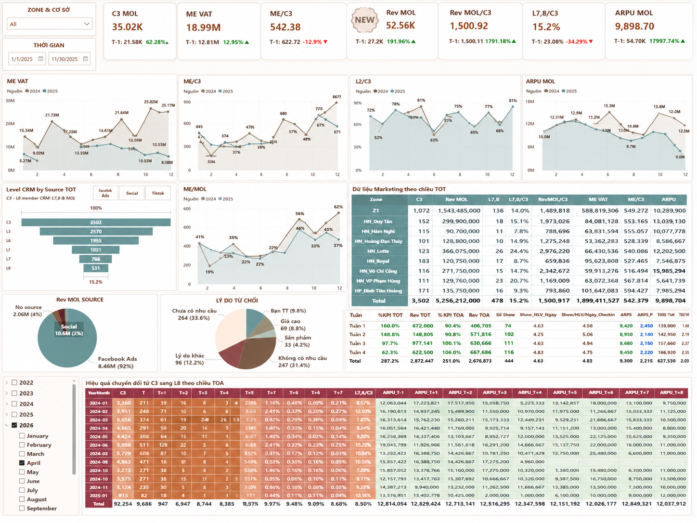

# 📣 Marketing Performance Dashboard

---

## Business Objective

This dashboard provides a comprehensive view of marketing performance by monitoring customer acquisition, CRM conversion funnel, marketing revenue, campaign effectiveness, and customer quality. It enables management to evaluate marketing efficiency, identify conversion bottlenecks, and optimize lead generation strategies.

---

## Key Performance Indicators (KPIs)

- C3 Leads
- Marketing Revenue (Rev MOL)
- Revenue per C3
- Revenue per MOL
- ARPU MOL
- ME Value
- ME/C3
- L2/C3
- L8/C3
- CRM Conversion Funnel (C3 → L8)
- Marketing Performance by Branch
- Marketing Performance by Source

---

## Technical Highlights

### Data Architecture
- Star Schema Data Model
- DirectQuery connection to the production database

### Power BI Development
- 50+ DAX Measures
- Power Query
- Interactive Dashboard
- Dynamic KPI Cards
- Time Intelligence
- Funnel Analysis
- Conditional Formatting
- Custom KPI Calculations

### Deployment
- Published to Power BI Service
- Scheduled Data Refresh
- Row-Level Security (RLS)

---

## 💡 Business Insights

- Monitor customer conversion across the CRM funnel from C3 to L8.
- Compare marketing performance by branch, source, and reporting period.
- Evaluate lead quality using ME, ARPU, and revenue-based KPIs.
- Identify major reasons for customer rejection to improve conversion strategies.
- Measure marketing effectiveness through revenue contribution and customer acquisition metrics.

---

## Recommendations

- Allocate marketing budget toward channels with higher conversion efficiency.
- Improve follow-up processes for leads that drop out during the CRM funnel.
- Monitor branch-level marketing performance to identify best practices.
- Reduce customer rejection by addressing the most common rejection reasons.
- Track weekly KPI trends to detect abnormal performance changes at an early stage.

---

## Business Value

This dashboard enables marketing managers to monitor lead quality, optimize conversion performance, improve marketing ROI, and support data-driven decision-making through centralized KPI reporting.

---

## Disclaimer

All names, business figures, and identifiers have been anonymized and scaled for portfolio purposes. The dashboard structure, business logic, and analytical approach remain representative of the original solution.
